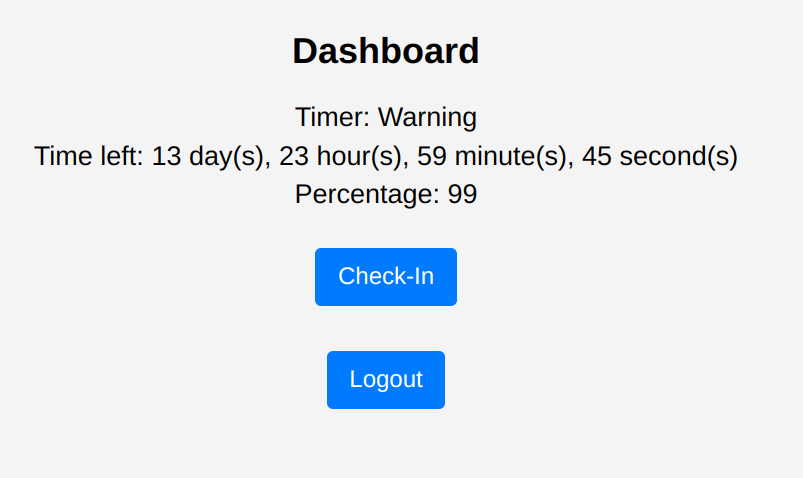

<p align="center">
  
</p>

# Dead Man's Switch for StartOS

Dead man's switches are designed to require positive action or they will
automatically deploy. They are ideal for situations where you are worried
about unforeseen death, kidnapping, or memory loss. If you don’t engage the
trigger for a certain amount of time, the switch automatically sends the desired
message.

<p align="center">
  
</p>

Dead Man's Switch comprises of two timers:

1. **Warning Timer**: This timer is set to the `timer_warning` (seconds) value
   in the configuration.
   If the user do not check-in before timer reaches 0,
   it will send a warning email to the users' own specified email address,
   the `from` in the configuration.
1. **Dead Man's Timer**: After the warning timer expires, the timer will change
   to a Dead Man's timer, and the timer will be set to the `timer_dead_man` (seconds).
   If the user do not check-in before timer reaches 0,
   it will send the final email to the specified email address in the configuration.

## Dependencies

Install the system dependencies below to build this project by following the instructions in the provided links. You can find instructions on how to set up the appropriate build environment in the [Developer Docs](https://docs.start9.com/latest/developer-docs/packaging).

- [docker](https://docs.docker.com/get-docker)
- [docker-buildx](https://docs.docker.com/buildx/working-with-buildx/)
- [yq](https://mikefarah.gitbook.io/yq)
- [deno](https://deno.land/)
- [make](https://www.gnu.org/software/make/)
- [start-sdk](https://github.com/Start9Labs/start-os/tree/sdk/)

## Build environment

Prepare your StartOS build environment. In this example we are using Ubuntu 20.04.

1. Install docker

    ```bash
    curl -fsSL https://get.docker.com | bash
    sudo usermod -aG docker "$USER"
    exec sudo su -l $USER
    ```

1. Set buildx as the default builder

    ```bash
    docker buildx install
    docker buildx create --use
    ```

1. Enable cross-arch emulated builds in docker

    ```bash
    docker run --privileged --rm linuxkit/binfmt:v0.8
    ```

1. Install yq

    ```bash
    sudo snap install yq
    ```

1. Install deno

    ```bash
    sudo snap install deno
    ```

1. Install essentials build packages

    ```bash
    sudo apt-get install -y build-essential openssl libssl-dev libc6-dev clang libclang-dev ca-certificates
    ```

1. Install Rust

    ```bash
    curl https://sh.rustup.rs -sSf | sh
    # Choose nr 1 (default install)
    source $HOME/.cargo/env
    ```

1. Build and install start-sdk

    ```bash
    git clone https://github.com/Start9Labs/start-os.git && \
    cd start-os && git submodule update --init --recursive && \
    make sdk
    ```

1. Initialize sdk & verify install

    ```bash
    start-sdk init
    start-sdk --version
    ```

Now you are ready to build the `dead-man-switch` package!

## Cloning

Clone the project locally:

```bash
git clone https://github.com/storopoli/dead-man-switch-startos.git
cd dead-man-switch-startos
git submodule update --init --recursive
```

## Building

To build the `dead-man-switch` package for all platforms using start-sdk, run the following command:

```bash
make
```

To build the `dead-man-switch` package for a single platform using start-sdk, run:

```bash
# for amd64
make x86
```

or

```bash
# for arm64
make arm
```

## Installing (on StartOS)

Run the following commands to determine successful install:
> :information_source: Change server-name.local to your Start9 server address

```bash
start-cli auth login
# Enter your StartOS password
start-cli --host https://server-name.local package install dead-man-switch.s9pk
```

If you already have your `start-cli` config file setup with a default `host`, you can install simply by running:

```bash
make install
```

> **Tip:** You can also install the dead-man-switch.s9pk using **Sideload Service** under the **System > Manage** section.

### Verify Install

Go to your StartOS Services page, select **Dead Man's Switch**, configure and start the service. Then, verify its interfaces are accessible.

**Done!**
